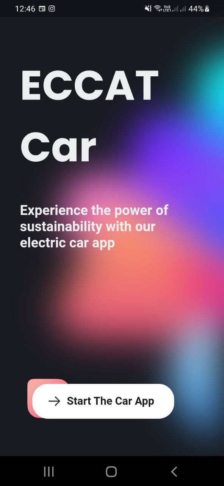
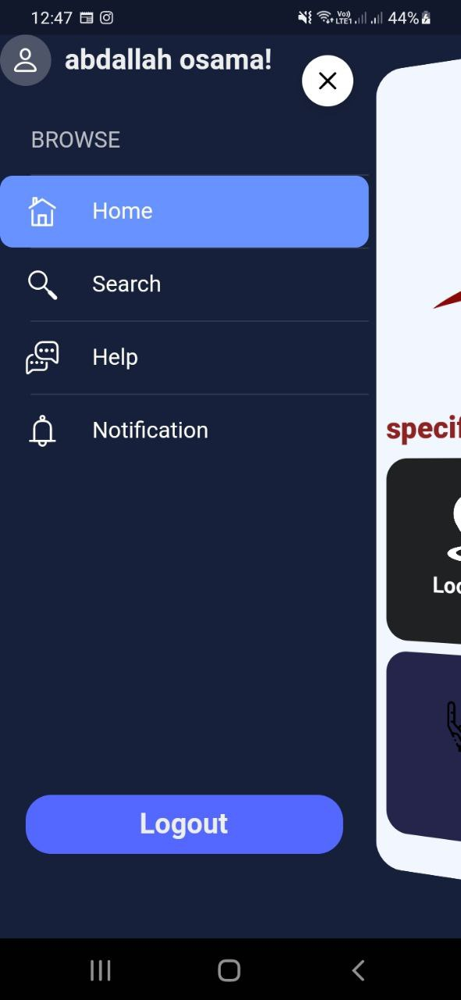
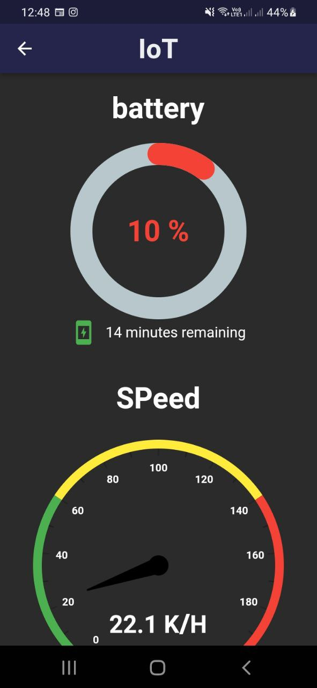
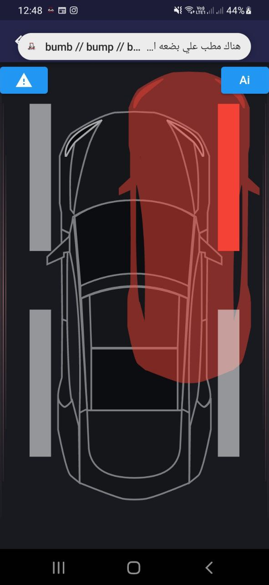
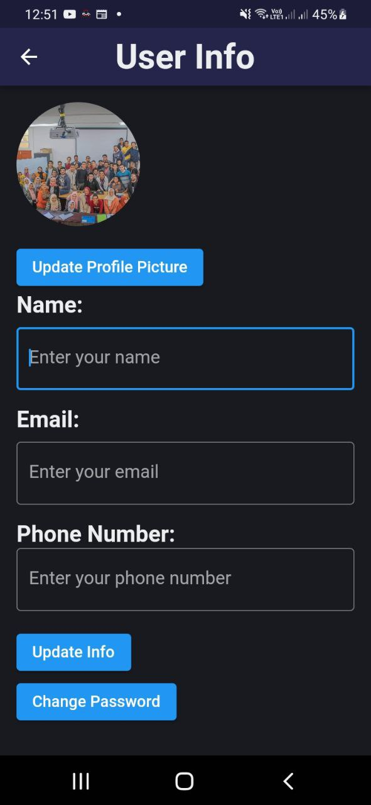
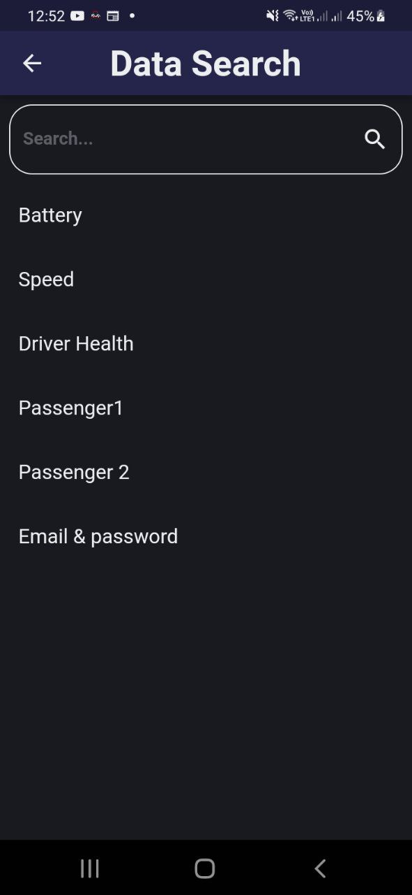
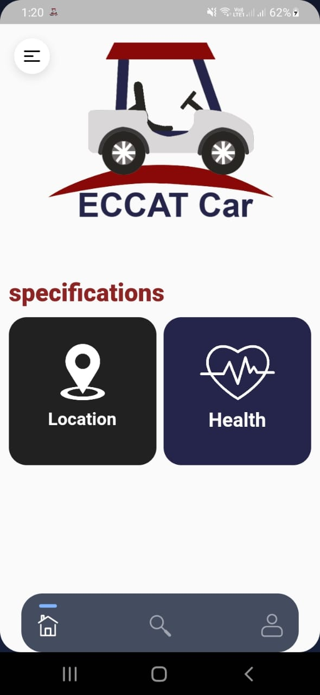

# 🚗 ECCAT_Gulf_Car – Smart Vehicle Mobile App

A collaborative graduation project involving multiple departments at ECCAT, integrating software and hardware to build a smart electric vehicle.

This repository contains the **mobile application** developed using Flutter and Firebase by the **Mobile Applications Team (Communication Technology Department)**.

## 📘 Project Overview

The ECCAT_Gulf_Car project was developed by students from multiple departments:

- 🛠️ Mechatronics: Vehicle design and motor control
- ⚡ Electronics: Sensor circuits and embedded systems
- 📶 Communication Technology: IoT, AI, Health Monitoring, Security & Mobile Apps

Our team's role was to develop a **Flutter-based mobile application** that integrates with real-time data collected from sensors designed by the other teams. The app connects to Firebase to receive and display sensor data, alerts, and analytics in real-time.

## 👤 User Roles & Features

The app supports three types of users, each with their own interface and functionalities:

### 🔐 Admin
- View who is driving the vehicle
- Receive alerts if an unauthorized person tries to drive
- Monitor health data of both driver and passenger
- View battery level and speed of the car
- Analyze vehicle performance over time

### 🚘 Driver
- See their own health vitals + the passenger's
- Monitor real-time vehicle speed and battery status
- Get alerts for obstacles like bumps or sidewalks

### 👥 Customer (Passenger)
- View personal health vitals
- Access basic driver information

## 🔧 Tech Stack

| Tech       | Purpose                             |
|------------|-------------------------------------|
| Flutter    | Frontend mobile development         |
| Dart       | Programming language                |
| Firebase   | Real-time database & auth backend   |
| IoT        | Sensor data integration             |
| AI/Security| Handled by other groups in the project |

## 📸 Screenshots

| Home Screen | Drawer Menu |
|-------------|-------------|
|  |  |

| IoT Data | Obstacle Alert |
|----------|----------------|
|  |  |

| Profile Info | Data Search |
|--------------|-------------|
|  |  |

| Signup Page | App Landing |
|-------------|-------------|
|  | .jpg) |

